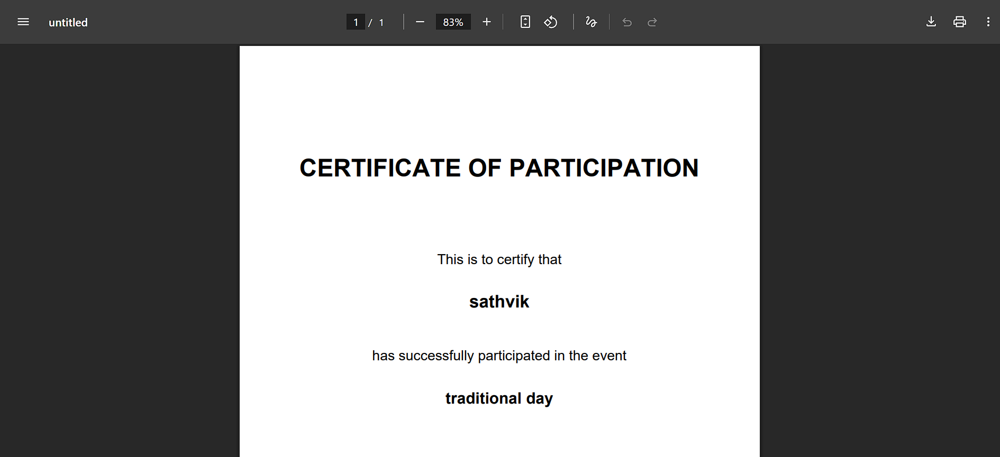

# 🎓 Campus EventHub – College Event Management System

Campus EventHub is a full-stack web application designed to manage college events efficiently.  
It provides role-based access for **students** and **admins**, supports **event registration**, **mock payments**, and **automatic certificate generation**.

This project was built as a **college mini-project** and also serves as a **portfolio showcase**.

---

## 🚀 Features

### 👨‍🎓 Student Module
- Student registration & login
- View upcoming and ongoing events
- Register for free and paid events (mock payment)
- View registered events
- Download participation certificates (PDF)
- Clean, responsive student dashboard

### 👨‍💼 Admin Module
- Admin login
- Create, edit, and delete events
- Manage all events from admin dashboard
- Mark events as completed
- Generate certificates for all registered students
- Scalable admin dashboard design

---

## 💳 Payment System
- Mock payment flow (Card / UPI / Wallet)
- Designed to be **gateway-agnostic**
- Can be easily replaced with real payment gateways like Razorpay or Stripe in the future

---

## 🎓 Certificate Generation
- Automatic PDF certificate generation
- Includes student name and event title
- Downloadable after event completion
- Implemented using ReportLab

---

## 🛠️ Tech Stack
- **Backend:** Python, Flask
- **Frontend:** HTML, Bootstrap 5
- **Database:** SQLite
- **PDF Generation:** ReportLab
- **Icons & UI:** Font Awesome, Bootstrap Components

---

## 📸 Screenshots

### Student Dashboard


### Admin Dashboard


### Admin – Manage Events


### Certificate (PDF)


---

## 🔮 Future Enhancements

The following features can be added to improve scalability and real-world usability:

- 🎨 Enhanced certificate design with:
  - College logo
  - Custom fonts
  - Background templates
- 💳 Integration with real payment gateways (Razorpay / Stripe)
- 📊 Admin analytics dashboard:
  - Event participation stats
  - Revenue tracking
- 📧 Email notifications:
  - Event registration confirmation
  - Certificate availability alerts
- 🏫 Multi-college support
- 🔐 Role-based permissions for event coordinators
- 📱 Improved mobile responsiveness
- 🔍 Advanced event search & filters

---

## 📌 Project Highlights
- Role-based authentication (Student / Admin)
- End-to-end event lifecycle management
- Clean UI with reusable components
- Real-world workflow simulation
- Portfolio-ready full-stack project


▶️ How to Run the Project Locally
## ▶️ How to Run the Project Locally

Follow these steps to run the Campus EventHub project on your local machine.

### 1️⃣ Clone the Repository
```bash
git clone https://github.com/sathvikyadav0714/Campus-EventHub.git
cd Campus-EventHub

2️⃣ Create a Virtual Environment
python -m venv venv

3️⃣ Activate the Virtual Environment

Windows

venv\Scripts\activate


Mac / Linux

source venv/bin/activate

4️⃣ Install Required Dependencies
pip install -r requirements.txt

5️⃣ Run the Application
python app.py

6️⃣ Open the Application in Browser
http://127.0.0.1:5000


🔐 Default Access

Students: Can register using the signup page

Admin: Login credentials are created during initial setup in the database

---

## 👤 Author
**Sathvik Yadav**  
Built as a college mini-project and portfolio application.
