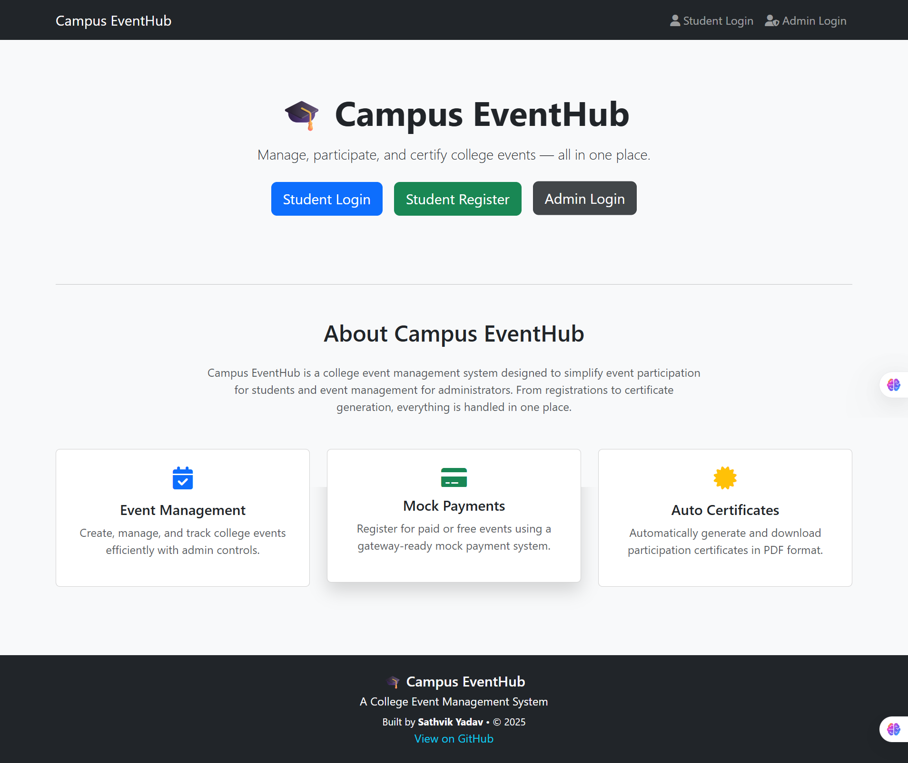
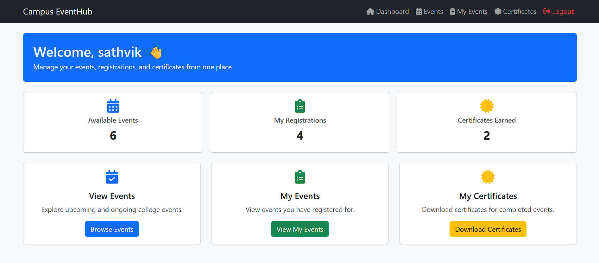
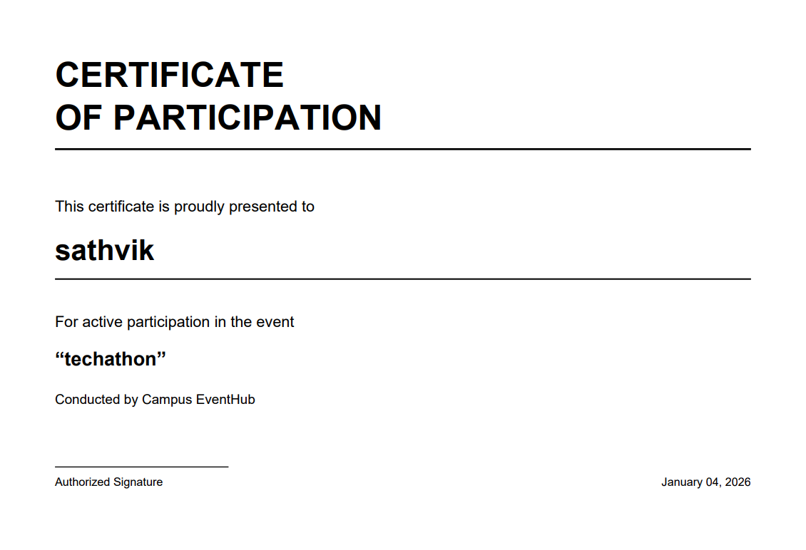
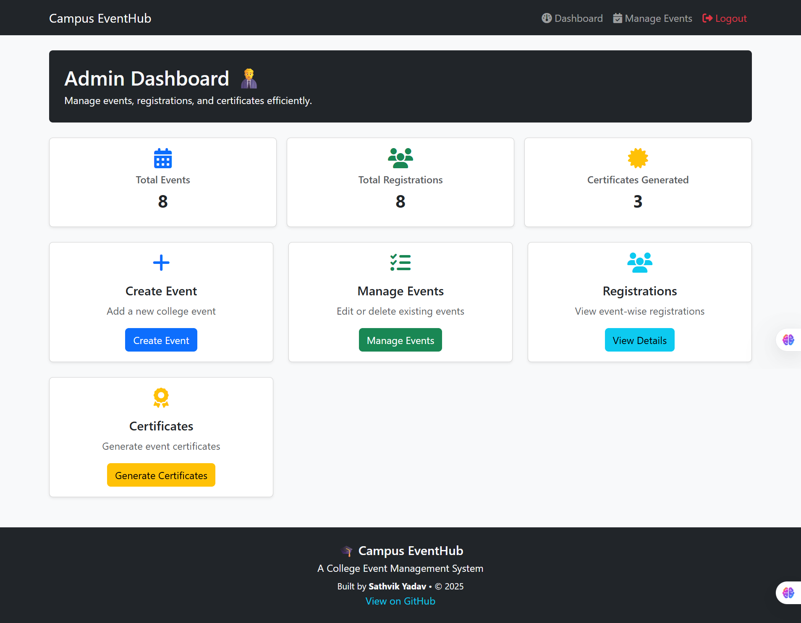
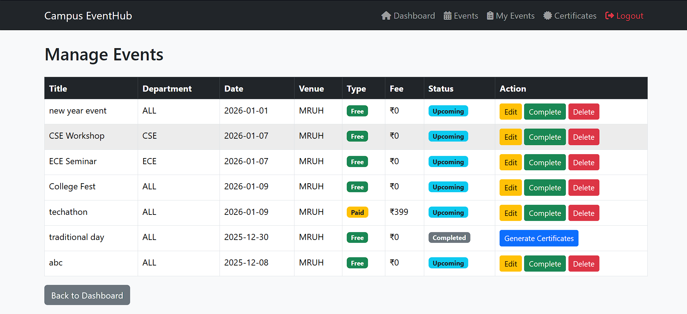

# 🎓 Campus EventHub – College Event Management System

Campus EventHub is a full-stack web application designed to manage college events efficiently.  
It provides role-based access for **Students** and **Admins**, supports **event registrations**, **mock payments**, **event-wise analytics**, and **automatic certificate generation**.

This project was built as a **college mini-project** and also serves as a **portfolio-ready full-stack application**.

---

## 🚀 Key Features

### 👨‍🎓 Student Module
- Student registration & secure login
- View upcoming and ongoing events
- Register for free and paid events (mock payment system)
- View registered events
- Download participation certificates (PDF)
- Modern student dashboard with cards & stats
- Responsive and clean UI

---

### 👨‍💼 Admin Module
- Secure admin login
- Create, edit, and delete events
- Event date validation (prevents past-date events)
- Prevent early event completion
- Manage all events from admin dashboard
- Mark events as completed
- Generate certificates for registered students
- Event-wise registrations overview
- View registered students per event
- Scalable and professional admin dashboard

---

## 📊 Admin Analytics
- Event-wise registration counts
- Student registration details per event
- Clear separation between event management and registrations monitoring

---

## 💳 Payment System (Mock)
- Mock payment flow (UPI / Card / Wallet)
- Designed to be **payment-gateway agnostic**
- Easily extendable to real gateways like Razorpay or Stripe

---

## 🎓 Certificate Generation
- Automatic PDF certificate generation
- Landscape, modern, professional layout
- Includes:
  - Student name
  - Event name
  - Organizer name
  - Date & signature
- Downloadable after event completion
- Implemented using **ReportLab**

---

## 🛠️ Tech Stack
- **Backend:** Python, Flask
- **Frontend:** HTML, Bootstrap 5
- **Database:** SQLite
- **PDF Generation:** ReportLab
- **UI & Icons:** Bootstrap Components, Font Awesome
- **Version Control:** Git & GitHub

---

## 📸 Screenshots

### Home Page


### Student Dashboard


### Student – Events


### Student – My Events


### Student – Certificates



---

### Admin Dashboard


### Admin – Manage Events


### Admin – Event-wise Registrations


### Admin – View Registered Students


---

## ▶️ How to Run the Project Locally

### 1️⃣ Clone the Repository
```bash
git clone https://github.com/sathvikyadav0714/Campus-EventHub.git
cd Campus-EventHub


2️⃣ Create a Virtual Environment
python -m venv venv

3️⃣ Activate the Virtual Environment

Windows

venv\Scripts\activate


Mac / Linux

source venv/bin/activate

4️⃣ Install Required Dependencies
pip install -r requirements.txt

5️⃣ Run the Application
python app.py

6️⃣ Open the Application in Browser
http://127.0.0.1:5000